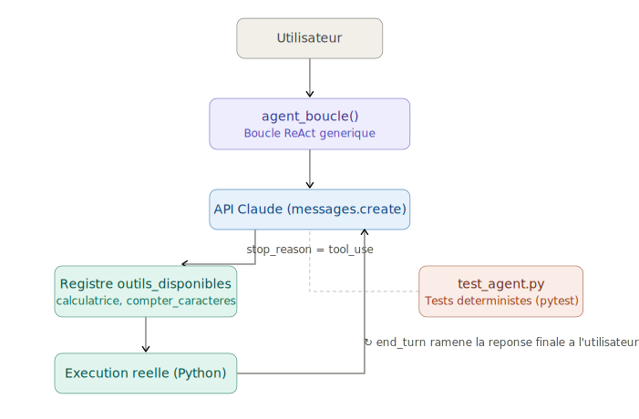

# agent-from-scratch

Premier projet du portfolio agentic AI : un agent minimal codé à la main, sans framework, pour comprendre le mécanisme fondamental d'une boucle agentique (ReAct) avant de déléguer cette logique à un framework comme LangGraph.

## Architecture

La boucle continue tant que le modèle demande des outils (`tool_use`), et s'arrête proprement dès qu'il a une réponse finale (`end_turn`).

## Outils implémentés

- **calculatrice** : addition, soustraction, multiplication, division
- **compter_caracteres** : compte les caractères d'un texte
- **inverser_texte** : inverse l'ordre des caracteres d'un texte (ex : "bonjour" → "ruojnob")

## Installation

\`\`\`bash
python3.12 -m venv venv
source venv/bin/activate
pip install anthropic python-dotenv pytest
\`\`\`

Créez un fichier `.env` à la racine avec votre clé API :
\`\`\`
ANTHROPIC_API_KEY=votre-cle-ici
\`\`\`

## Utilisation

\`\`\`bash
python3.12 agent.py
\`\`\`

## Tests

Couche de tests déterministes (validation de la logique des outils, sans appel API) :
\`\`\`bash
pytest test_agent.py -v
\`\`\`

## Indicateurs observés (KPIs niveau 1)

- **Latence** : ~2-4 secondes pour une requête à 2 outils (2 appels API)
- **Coût** : quelques centimes par exécution complète

## Ce que ce projet démontre

## Ce que ce projet démontre

Comprendre la mécanique d'un agent (boucle Reasoning → Action → Observation, tool calling, condition d'arrêt) avant d'utiliser un framework — la brique de base de tout le reste du parcours. Le registre `outils_disponibles` permet d'ajouter facilement de nouveaux outils sans modifier la boucle elle-même, et l'agent gère nativement plusieurs appels d'outils simultanés dans une seule itération.